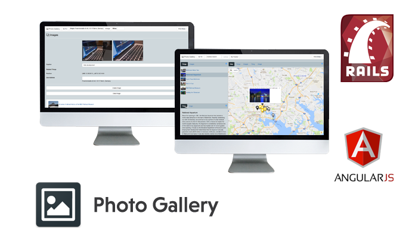

# Photo Gallery v1.0.0



The Photo Gallery is a web application for photographers with Geo location features.

[Screenshots](Screenshots/)

## Installation

* Install all necessary ruby gems `bundle install`

## Setup

* Setup a SQLite3 or PostgreSQL connection `vim config/database.yml`
* Setup a Mongo DB connection `vim config/mongoid.yml`
* Create a database `bundle exec rake db:create`
* Migrate database tables `bundle exec rake db:migrate`
* Set Google Maps API key for back-end `echo 'GMAPS_JSMAPS_KEY: "API_KEY"' > config/application.yml'`
* Set Google Maps API key for front-end `echo 'GMAPS_GEOCODE_KEY: "API_KEY"' >> config/application.yml`
* Populate a database `rake ptourist:reset_all`

## Requirements

* Ruby on Rails 5
* SQLite3 / PostgreSQL + Mongo DB

## Run application

* `rails s`

## Run RSpec tests

* `bundle exec rspec`

## Libraries

 * [AngularJS](https://angularjs.org/) - AngularJS is a Single Page Application framework
 * [Twitter Bootstrap](https://github.com/twbs/bootstrap-sass) - Twitter Bootstrap for Sass
 * [Font Awesome](http://fontawesome.io/) - The iconic font and css toolkit
 * [Gulp](https://gulpjs.com/) - The gulp is a toolkit that helps you automate time-consuming tasks in your development workflow
 * [Exifr](https://github.com/remvee/exifr/) - The EXIF Reader is a module to read metadata from JPEG and TIFF images
 * [mini-magick](https://github.com/minimagick/minimagick) - A ruby wrapper for ImageMagick or GraphicsMagick
 * [Rest client](https://github.com/rest-client/rest-client) - A simple HTTP and REST client for Ruby language
 * [Devise](https://github.com/plataformatec/devise) - Flexible authentication solution for Rails with Warden
 * [Pundit](https://github.com/elabs/pundit) - Object oriented authorization library for Rails applications
 * [RSpec](http://rspec.info/) - Behaviour Driven Development for Ruby
 * [Capybara](https://github.com/teamcapybara/capybara) - Capybara is an integration testing tool for rack based web applications
 * [PhantomJS](http://phantomjs.org/) - PhantomJS is a headless WebKit scriptable with a JavaScript API
 * [Poltergeist](https://github.com/teampoltergeist/poltergeist) - Poltergeist is a driver for Capybara that allows you to run your tests on a headless WebKit browser, provided by PhantomJS
 * [Selenium](http://www.seleniumhq.org/) - Selenium is a tool for writing automated tests of websites

# License - Apache License, Version 2.0

```
# (C) Copyright 2017 by Marek Hakala <hakala.marek@gmail.com>
# Licensed under the Apache License, Version 2.0 (the "License");
# you may not use this file except in compliance with the License.
# You may obtain a copy of the License at
#
# http://www.apache.org/licenses/LICENSE-2.0
#
# Unless required by applicable law or agreed to in writing, software
# distributed under the License is distributed on an "AS IS" BASIS,
# WITHOUT WARRANTIES OR CONDITIONS OF ANY KIND, either express or implied.
# See the License for the specific language governing permissions and
#    limitations under the License.
```
